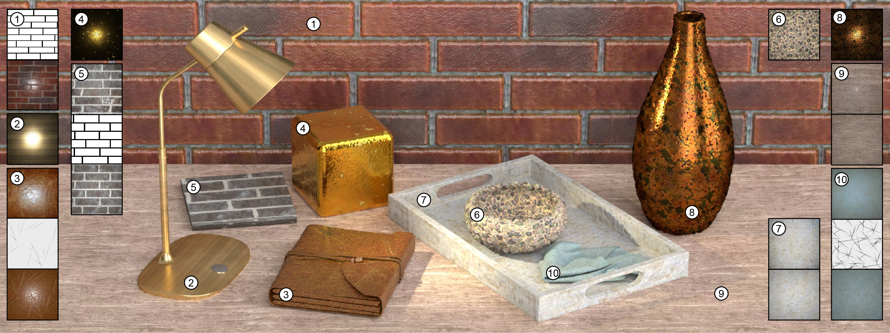
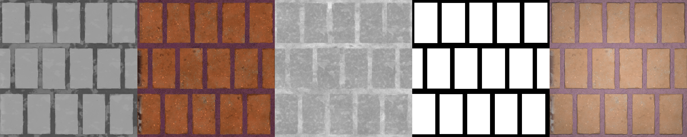
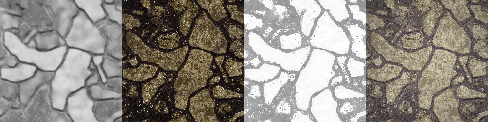

# TileGen: Tileable, Controllable Material Generation and Capture

This is code of "TileGen: Tileable, Controllable Material Generation and Capture" [Project](https://people.engr.tamu.edu/nimak/Papers/SIGAsia2022_TileGen/index.html) | [Paper](https://people.engr.tamu.edu/nimak/Papers/SIGAsia2022_TileGen/final_paper.pdf)



## Requirements

set up environments, please run below (tesed in Linux):

```
conda env create -f env.yml
```

## Sampling and Inverse Rendering

Please download pretrained model of from this [link](https://drive.google.com/file/d/1WXH13QA26iCYT3yScLlxN386kHTPRuy2/view?usp=share_link) and extract to `./output`.

For sampling, please run these:


```
Tile:

python projector.py --name Tile --ckpt 800000.pt --starting_height_size 32 --mode sample --savename $save_folder --pat_path ./Data/Bricks_test_pat_demo --circular --channel_multiplier 1 --nocond_z --H_scale 10 --dataset Tile

Leather:

python projector.py --name Leather --ckpt 520000.pt --starting_height_size 4 --mode sample --savename $save_folder --pat_path ./Data/Leather_test_pat_demo --circular --nocond_z --channel_multiplier 1 --H_scale 5 --dataset Leather

Stone:

python projector.py --name Stone --ckpt 800000.pt --starting_height_size 4 --mode sample --savename $save_folder --circular --channel_multiplier 1 --nocond_z --H_scale 10 --dataset Stone --no_cond

Metal:

python projector.py --name Metal --ckpt 800000.pt --starting_height_size 4 --mode sample --savename $save_folder --circular --channel_multiplier 1 --nocond_z --H_scale 5 --dataset Metal --no_cond

```

Where

```
--pat_path: reprents the path of input conditional patterns

```
The results of stone, for example, will be saved to `output/stone/sample/$save_folder`

For inverse rendering, please run these commands:

```
Tile

python projector.py --name Tile --ckpt 800000.pt --starting_height_size 32 --mode project --optim w+n --opt_scale --savename $save_folder --pat_path ./Data/Bricks_test_pat_demo --data_path ./Data/Bricks --circular --channel_multiplier 1 --nocond_z --H_scale 20 --init mean --dataset Tile --step 500 --lr 0.02 --inter_shift 

Leather

python projector.py --name Leather --ckpt 520000.pt --starting_height_size 4 --mode project --optim w+n --savename $save_folder --opt_scale --pat_path ./Data/Leather_test_pat_demo  --data_path ./Data/Leathers --circular --channel_multiplier 1 --nocond_z --H_scale 5 --dataset Leather --init rand --lr 0.02 --steps 500 --inter_shift

Metal

python projector.py --name Metal --ckpt 800000.pt --starting_height_size 4 --mode project --optim w+n --opt_scale --savename $save_folder --data_path ./Data/Metal --circular --no_cond --channel_multiplier 1 --H_scale 5 --dataset Metal --lr 2e-2 --steps 500 --init embed --inter_shift

Stone

python projector.py --name Stone --ckpt 800000.pt --starting_height_size 4 --mode project --optim w+n --opt_scale --savename $save_folder --data_path ./Data/Stone --circular --no_cond --channel_multiplier 1 --H_scale 10 --init embed --dataset Stone --step 500 --lr 0.02 --inter_shift

```

The results of stone, for example, will be saved to `output/stone/project/$save_folder`, in each folder, `opt_D`,`opt_H`,`opt_N`,`opt_R`,`opt_M` represent final optimized diffuse, height, normal, roughness and metallic (for metal only); 
suffix `_t` represents the 2x2 tiled version of maps and re-rendered images; `scale.pt` save the optimzed parameters of height-normal-scale and light intensty scale (only when use `--opt_scale`)

For some arguments:

```
--data_path: load the target example from this directory

--opt_scale: optimized both height-to-normal scale and light intensity scale

--init: ['embed', 'mean', 'rand'] initialization of latent space, for unconditional models we use predefine 'embed'; for conditional models, use either 'mean' or 'rand';

--inter_shift: keep shifting maps every other iterations during optimization

``` 


## Train on your own dataset

You may need to define your own customized dataloader to fit your dataset. But here we provide guidance using our training code:

1. you need to specify the location of train and val dataset in `config/scene_cfg` folder, you can set train and val dataset same directory. 
2. you need to define your own dataloader

In TileGen, below is an example of conditional dataset (height + diffuse + roughness + pattern + rendered): 



Below is an examples of unconditional dataset (height + diffuse + roughness + rendered):




To trian conditional model (like leather), please run this command:

```
python -m torch.distributed.launch --nproc_per_node=$gpu_num train_scene.py $name --batch_size $batch_per_gpu --nocond_z --tile_crop --aug_data --lr 0.0002 --vgg_regularize 0.0 --style_regularize 1.0 --channel_multiplier 1 --shiftN --cond_D --circular --starting_height_size 4 --dataset Leather
```

To train unconditional model (like stone), please run this command:

```

python -m torch.distributed.launch --nproc_per_node=$gpu_num train_scene.py $name --batch_size $batch_per_gpu --nocond_z --channel_multiplier 1 --tile_crop --aug_data --lr 0.0002 --vgg_regularize 0.0 --style_regularize 0.0 --no_cond --circular --starting_height_size 4 --dataset Stone

```

For some arguments:

```
--channel_multiplier: [default 2] control the channel number in Generator

--starting_height_size: [default 32] encoder feature passed to generator, support 4,8,16,32

--tile_crop: tile cropping and shifting during training

--style_regularize: control style for conditional model

--shift_N: control style for conditional model
```
## Citation

If you find this work useful for your research, please cite:

```

@inproceedings{zhou2022tilegen,
  title={TileGen: Tileable, Controllable Material Generation and Capture},
  author={Zhou, Xilong and Hasan, Milos and Deschaintre, Valentin and Guerrero, Paul and Sunkavalli, Kalyan and Kalantari, Nima Khademi},
  booktitle={SIGGRAPH Asia 2022 Conference Papers},
  pages={1--9},
  year={2022}
}

```

## Contact

Please contact Xilong Zhou (1992zhouxilong@gmail.com) if there are any issues/comments/questions.

## License

Copyright (c) 2023, Xilong Zhou. 

All rights reserved.

